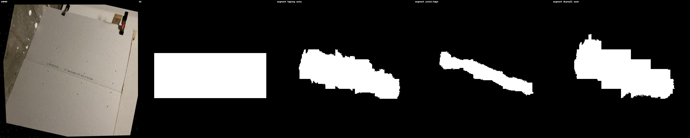
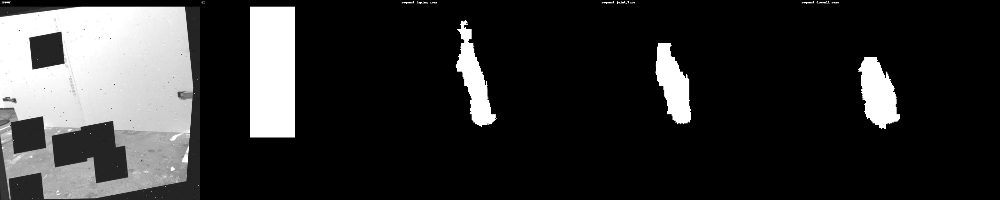
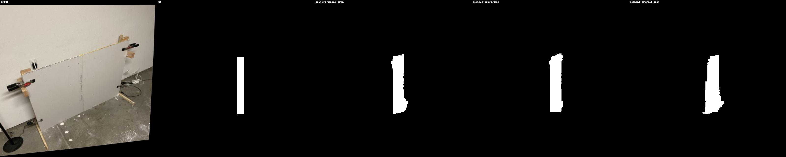
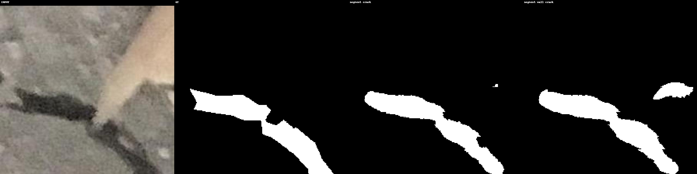
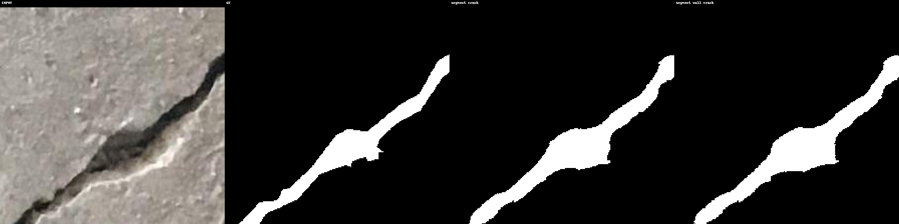

# Prompted Segmentation for Drywall QA

This repository implements **text-conditioned segmentation** for automated drywall QA using a fine-tuned **CLIPSeg** model.

We handle two datasets:

- **Dataset 1 – Taping area**  
  - Base dataset: [Drywall Joint Detect (Roboflow)](https://universe.roboflow.com/objectdetect-pu6rn/drywall-join-detect)  
  - Prompts:
    - `"segment taping area"`
    - `"segment joint/tape"`
    - `"segment drywall seam"`

- **Dataset 2 – Cracks**  
  - Base dataset: [Cracks Segmentation (Roboflow)](https://universe.roboflow.com/ay-7aga/cracks-segmentation/dataset/2)  
  - Prompts:
    - `"segment crack"`
    - `"segment wall crack"`

The model is trained on **224×224** images/masks (CLIP-standard input size), and predicted masks are **upsampled back to the original resolution (e.g., 640×640)** for saving and evaluation.

---

## 1. Requirements

```bash
pip install -r requirements.txt
````

Tested with Python 3.8+ and PyTorch 2.0+.

---

## 2. Dataset Layout

The code expects the following structure under your assignment root:

```text
/media/sdb_access/Assignment/
│
├── Dataset_1/                # Taping area
│   ├── train/
│   ├── train_annotations.coco.json
│   ├── valid/
│   └── valid_annotations.coco.json
│
└── Dataset_2/                # Cracks
    ├── train/
    ├── train_annotations.coco.json
    ├── valid/
    ├── valid_annotations.coco.json
    ├── test/
    └── test_annotations.coco.json
```

* **Dataset 1 (taping area)**: annotations are **bounding boxes only** (COCO detection style).
  During loading, each bounding box is converted into a **filled rectangular mask**.

* **Dataset 2 (cracks)**: annotations are **polygon segmentations** (COCO segmentation style).
  Masks are rasterized from the polygons.

---

## 3. How the Model Works

* Backbone: `CIDAS/clipseg-rd64-refined` (HuggingFace)
* Input: image + a **text prompt**
* Output: a **binary segmentation mask**
* Training:

  * Input images and GT masks are resized to **224×224**
  * Loss: Binary Cross-Entropy with logits
* Inference:

  * Predicted mask at 224×224 is upsampled to the **original image size**
  * Saved as **single-channel PNG** with values `{0, 255}`

**Multiple prompts** per dataset are supported:

* Training uses a **canonical prompt** (first in the list per dataset)
* Evaluation & inference run over **all prompts**, and report metrics per prompt

---

## 4. Running the Pipeline

All commands assume:

* `--data_root /media/sdb_access/Assignment`
* `--output_root ./outputs`

You can change these if needed.

### 4.1 One-shot pipeline (train + eval + infer)

This runs:

1. Training
2. Validation on all prompts
3. Inference on all prompts
4. Report + timing + stacked visual generation

---

#### 🔹 Cracks (Dataset 2)

```bash
python -m src.main \
  --mode full \
  --dataset cracks \
  --data_root /media/sdb_access/Assignment \
  --output_root ./outputs \
  --batch_size 4 \
  --image_size 224 \
  --epochs 10 \
  --lr 1e-5
```

#### 🔹 Taping (Dataset 1)

```bash
python -m src.main \
  --mode full \
  --dataset taping \
  --data_root /media/sdb_access/Assignment \
  --output_root ./outputs \
  --batch_size 4 \
  --image_size 224 \
  --epochs 10 \
  --lr 1e-5
```

---

### 4.2 Running modes separately

You can also run **train**, **eval**, and **infer** as separate stages.

#### (a) Train

**Cracks:**

```bash
python -m src.main \
  --mode train \
  --dataset cracks \
  --data_root /media/sdb_access/Assignment \
  --output_root ./outputs \
  --batch_size 4 \
  --image_size 224 \
  --epochs 50 \
  --lr 1e-5
```

**Taping:**

```bash
python -m src.main \
  --mode train \
  --dataset taping \
  --data_root /media/sdb_access/Assignment \
  --output_root ./outputs \
  --batch_size 4 \
  --image_size 224 \
  --epochs 50 \
  --lr 1e-5
```

This will save a best checkpoint (by Dice) at:

* `./outputs/checkpoints/cracks_best.pth`
* `./outputs/checkpoints/taping_best.pth`

---

#### (b) Evaluation (per prompt metrics)

**Cracks:**

```bash
python -m src.main \
  --mode eval \
  --dataset cracks \
  --data_root /media/sdb_access/Assignment \
  --output_root ./outputs
  # --checkpoint can be given explicitly; uses cracks_best.pth by default
```

**Taping:**

```bash
python -m src.main \
  --mode eval \
  --dataset taping \
  --data_root /media/sdb_access/Assignment \
  --output_root ./outputs
  # uses taping_best.pth by default
```

This prints and logs **per-prompt** metrics (loss, mIoU, Dice) to:

* `outputs/cracks/prompt_metrics.txt`
* `outputs/taping/prompt_metrics.txt`

---

#### (c) Inference (PNG masks + stacked visualizations)

**Cracks:**

```bash
python -m src.main \
  --mode infer \
  --dataset cracks \
  --data_root /media/sdb_access/Assignment \
  --output_root ./outputs \
  --checkpoint ./outputs/checkpoints/cracks_best.pth
```

**Taping:**

```bash
python -m src.main \
  --mode infer \
  --dataset taping \
  --data_root /media/sdb_access/Assignment \
  --output_root ./outputs \
  --checkpoint ./outputs/checkpoints/taping_best.pth
```

This will:

* Save predicted masks per prompt in:

  * `outputs/predictions/cracks/<prompt_tag>/...`
  * `outputs/predictions/taping/<prompt_tag>/...`

  where `prompt_tag` is a filesystem-safe version of the prompt, e.g.:

  * `"segment crack"` → `segment_crack`
  * `"segment joint/tape"` → `segment_joint_tape`

* Save **stacked visualizations** in:

  * `outputs/predictions/cracks/stacked/`
  * `outputs/predictions/taping/stacked/`

Each stacked image is:

```text
[input | GT | prompt_1_mask | prompt_2_mask | ...]
```

with the **prompt text written along the top border** of each mask tile.

---

## 5. Outputs & Reports

For each dataset (`cracks`, `taping`) the code writes a set of TXT reports under:

```text
outputs/<dataset>/
    report_train.txt
    prompt_metrics.txt
    inference_timings.txt
```

### 5.1 `report_train.txt`

Includes:

* Train / val / test counts
* Per-epoch training time
* Total training time
* Approx. model size (MB of trainable parameters)
* Brief qualitative failure notes (thin structures, cluttered regions, etc.)

### 5.2 `prompt_metrics.txt`

Per-prompt metrics for each run (loss, mIoU, Dice), logged for different phases:

* `val_last_epoch`
* `val_eval`
* `val_final_full`, etc.

### 5.3 `inference_timings.txt`

* Number of images
* Number of prompts
* Total inference time (all prompts)
* Average time per image per prompt

---

## 6. Results

Below are example statistics from one run of the full pipeline.

### 6.1 Cracks Dataset

**Inference timing (from `outputs/cracks/inference_timings.txt`):**

```text
================================================================================
Inference Timing Report - Dataset: cracks
================================================================================

Train images: 1431
Val images:   34
Test images:  35
Number of prompts: 2
Total inference time (all prompts): 2.264 s
Average time per image per prompt: 0.032341 s

Prompts used:
- segment crack
- segment wall crack
```

**Per-prompt metrics (from `outputs/cracks/prompt_metrics.txt`, split: `val_final_full`):**

```text
================================================================================
Per-prompt Metrics - Dataset: cracks - Split: val_final_full
================================================================================

Prompt                                   |   Loss |   mIoU |  Dice
--------------------------------------------------------------------------------
segment crack                            | 0.0891 | 0.5222 | 0.6111
segment wall crack                       | 0.1038 | 0.5766 | 0.6561
```

---

### 6.2 Taping Dataset

**Inference timing (from `outputs/taping/inference_timings.txt`):**

```text
================================================================================
Inference Timing Report - Dataset: taping
================================================================================
Train images: 820
Val images:   202
Number of prompts: 3
Total inference time (all prompts): 17.021 s
Average time per image per prompt: 0.028087 s

Prompts used:
- segment taping area
- segment joint/tape
- segment drywall seam
```

**Per-prompt metrics (from `outputs/taping/prompt_metrics.txt`, split: `val_eval`):**

```text
================================================================================
Per-prompt Metrics - Dataset: taping - Split: val_eval
================================================================================

Prompt                                   |   Loss |   mIoU |  Dice
--------------------------------------------------------------------------------
segment taping area                      | 0.2020 | 0.5405 | 0.6834
segment joint/tape                       | 0.3026 | 0.4088 | 0.5548
segment drywall seam                     | 0.4626 | 0.3820 | 0.5178
```

These numbers, plus the stacked visuals, are ready to go directly into your assignment report.

---


## 🚀 Visual Samples

### **Taping Dataset**

Each panel shows:  
**Input | Ground Truth | segment taping area | segment joint/tape | segment drywall seam**

| Sample 1 | Sample 2 |
|---------|----------|
|  |  |

| Sample 3 | Sample 4 |
|---------|----------|
|  |  |

---

### **Cracks Dataset**

Each panel shows:  
**Input | Ground Truth | segment crack | segment wall crack**

| Sample 1 | Sample 2 |
|---------|----------|
|  |  |

| Sample 3 | Sample 4 |
|---------|----------|
|  |  |

---

## 7. Notes for the Assignment Report

* **Data preprocessing**:

  * Dataset 1 masks derived from **bounding boxes** (rectangular regions).
  * Dataset 2 masks derived from **polygon segmentations**.
* **Model**:

  * CLIPSeg fine-tuned with text prompts.
  * Input: 224×224, output upsampled to original size.
* **Evaluation**:

  * Per-prompt metrics show how sensitive performance is to the exact wording of the prompt.
  * Timing reports demonstrate runtime and feasibility for deployment.


## References

We used the following foundational models and resources in this project:

### CLIPSeg (Segmentation Backbone)
Lüddecke, T., & Wörtwein, T. (2022).  
**"CLIPSeg: Image Segmentation Using Text and Image Prompts."**  
CVPR 2022.  
Paper: https://arxiv.org/abs/2111.15490  
GitHub: https://github.com/timojl/clipseg

```
@inproceedings{lueddecke2022clipseg,
  title={CLIPSeg: Image Segmentation Using Text and Image Prompts},
  author={L{"u}ddecke, Timo and W{"o}rtwein, Theodor},
  booktitle={Proceedings of the IEEE/CVF Conference on Computer Vision and Pattern Recognition},
  year={2022}
}
```

### CLIP (Text–Image Encoder)
Radford, A. et al. (2021).  
**"Learning Transferable Visual Models From Natural Language Supervision."**  
ICML 2021.  
Paper: https://arxiv.org/abs/2103.00020

```
@inproceedings{radford2021learning,
  title={Learning Transferable Visual Models From Natural Language Supervision},
  author={Radford, Alec and Kim, Jong Wook and Hallacy, Chris and Ramesh, Aditya and others},
  booktitle={International Conference on Machine Learning},
  year={2021}
}
```

### HuggingFace Model
Model used: `CIDAS/clipseg-rd64-refined`  
https://huggingface.co/CIDAS/clipseg-rd64-refined

```
@misc{wolf2020transformers,
  title={Transformers: State-of-the-Art Natural Language Processing},
  author={Wolf, Thomas and others},
  year={2020},
  eprint={1910.03771},
  archivePrefix={arXiv}
}